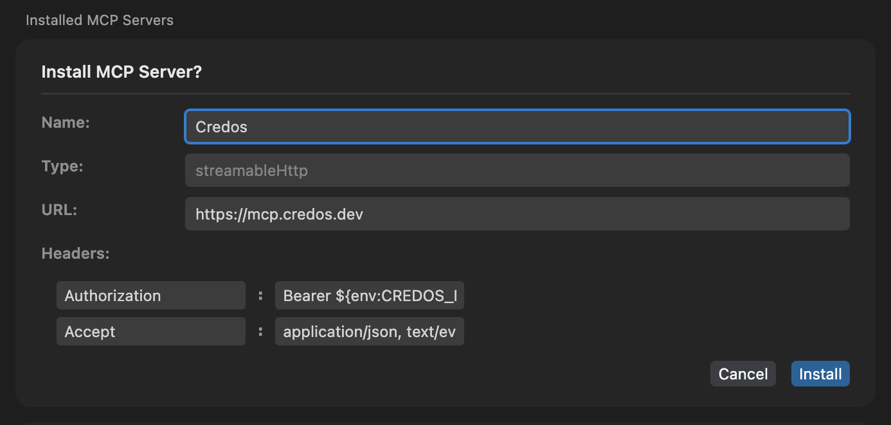

# Credos

Share your team's coding best practices with Cursor.

---

## Plugin Setup

### 1. Install the Credos plugin

> **Note:** In the installation confirmation view, change the `server` name to `Credos`.



### 2. Get an API key

from your [Credos account](https://credos.dev)

### 3. Set the API key in your machine

**macOS** — add to `~/.zshrc`:

```sh
echo 'export CREDOS_MCP_API_KEY="your-api-key-here"' >> ~/.zshrc && source ~/.zshrc
```

**Linux** — add to `~/.bashrc`:

```sh
echo 'export CREDOS_MCP_API_KEY="your-api-key-here"' >> ~/.bashrc && source ~/.bashrc
```

**Windows** — PowerShell (run as Administrator):

```powershell
[Environment]::SetEnvironmentVariable("CREDOS_MCP_API_KEY", "your-api-key-here", "User")
```

### 4. Restart Cursor

so that the new environment variable is picked up everywhere

### 5. Turn on Credos MCP server

from Cursor settings

---

## Manual Setup

Prefer to set things up yourself? See the [Cursor integration docs](https://credos.dev/docs/integrations/cursor) for step-by-step instructions to manually configure Credos MCP server.
